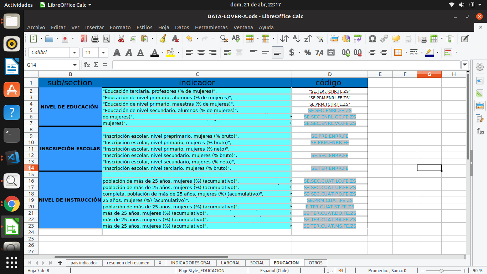
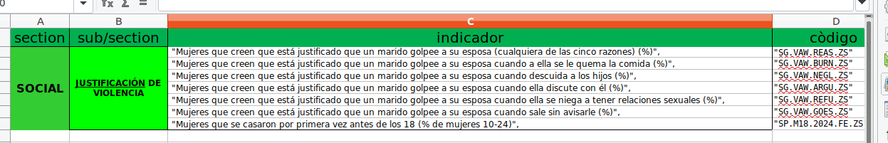
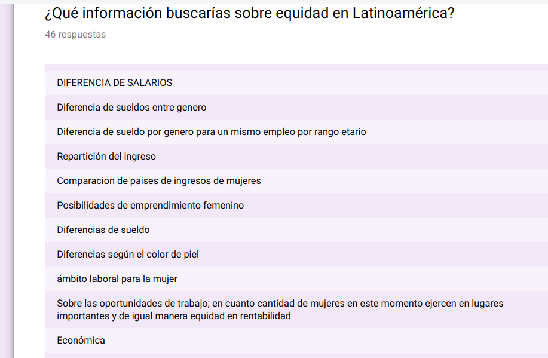
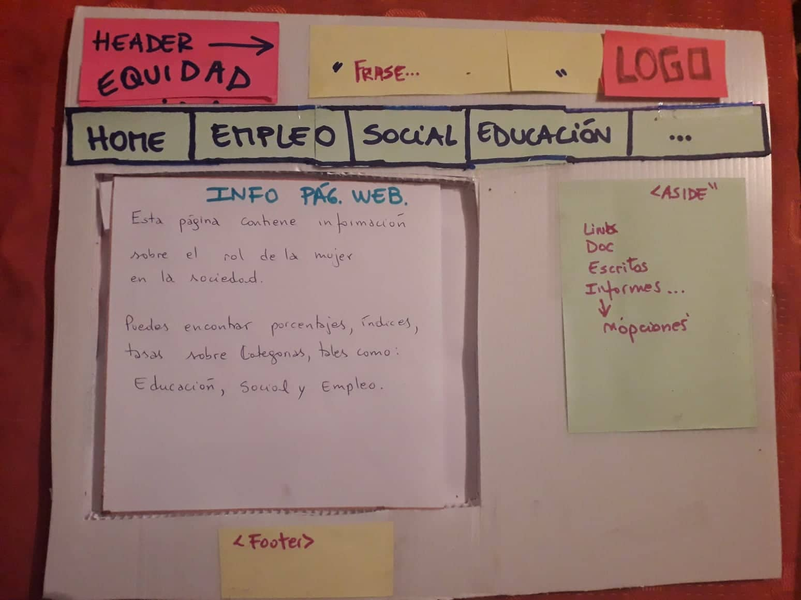
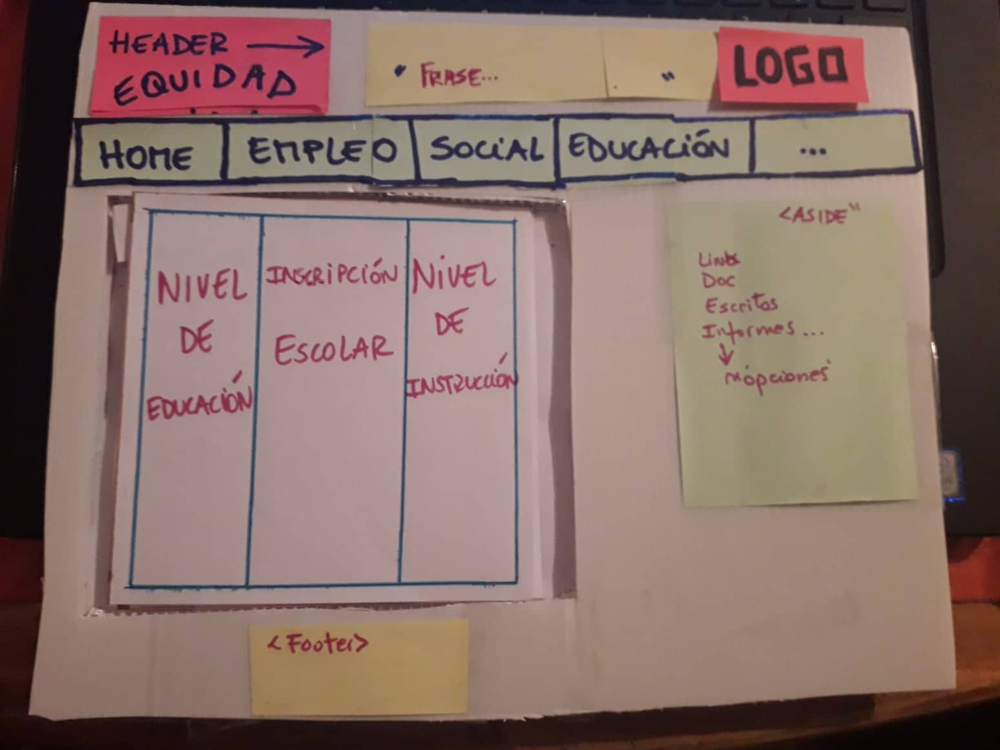
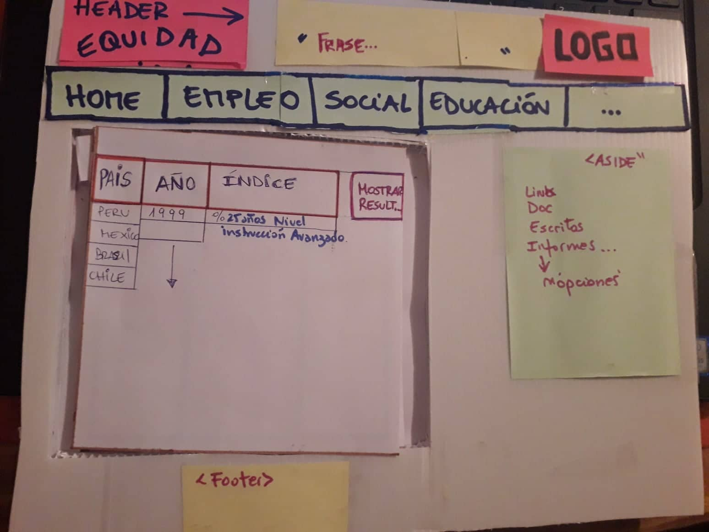
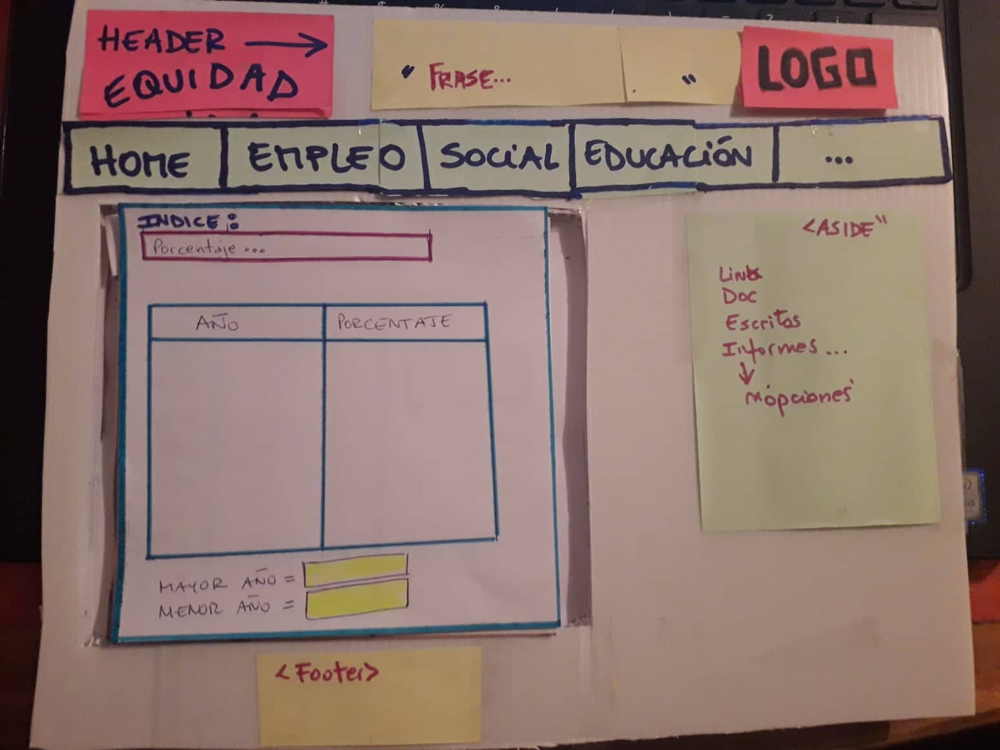

## INDICE:

 1. Preambulo 
 2. Resumen del Proyecto
 3. Objetivos del Proyecto
 4. Etapas del Proyecto

##EQUIDAD DE GENERO

# **1. Preámbulo**

Equidad de género, página web diseñada y construida a partir de "Data Banco mundial".  La equidad de género tiene que ver con la igualdad de oportunidades y derechos para todos. Por lo tanto,  es importante que la sociedad valore de la misma manera las similitudes y las diferencias de los hombres y las mujeres, así como las funciones que desempeñan, estas relaciones que evolucionan con el tiempo y en las que influyen factores socioeconómicos, políticos y culturales. 

                 "Los cambios en la combinación de estos factores pueden afectar de  manera positiva o negativa".

Durante el siglo pasado hubieron cambios importantes, se incorporó un gran número de mujeres a la fuerza de trabajo y a la política, se progreso en mayor disponibilidad de medios de control de la reproducción, alteraron considerablemente las relaciones entre las mujeres y los hombres. 

Todos estas causas y consecuencias de manera dinámica, es decir, que involucra todos los aspectos de la vida en sociedad, ya sea, laboral, educacional, social, emocional, ambiental y política, pueden ser medidas y reflejadas en números reperesentativos de tasas e índices comparativos, entre paises, pero también en aspectos estadísticos, como lo es el sexo o rangos de edad.

Equidad de género tiene como objeto primario, fijado en  la etapa de investigacion  "la obtencion de índices y tasas, accesibles a través de la data WORLDBANK".

## **2. Resumen del proyecto**

El área de interés  que requiere visualizar este proyecto " Página web - Equidad de Género" , son las mediciones realizadas por el banco mundial, referente al rol de la mujer en latinoamérica.  Se entrega por medio de una búsqueda, que realiza el propio usuario, el valor númerico de tasas o índices  tales como: Fuera laboral, desempleo, tasa de participación, justificación de la violencia, nivel de educación o instrucción e inscripcion escolar.

A través de las categorías mencionadas, el usuario en busqueda de información, en procesos de investigación o adquisión de conocimientos, por ejemplo estudiantes, grupos que potencian el rol y participacion femenina, pueden hacer uso de estos datos como estimen conveniente.

En explicito las usuarias principales son mujeres que requieren información, como se detallo en el parrafo anterior, y estos datos se veran reflejados en una página web amigable que le permita cumplir sus expectativas.

* [Banco Mundial](src/data/worldbank/worldbank.json) Indicadores de desarrollo del Banco Mundial de algunos países (Brasil, Chile, México y Perú). Estos datos incluyen indicadores demográficos, económicos y comerciales.

 
 

## **3. Objetivos de PROYECTO**

Creación de una página web, en la cual el usuario pueda acceder a información deacuerdo a sus propios filtros , la cual puede visualizar e interactuar, ordenando los datos, obtener cálculos como promedio de los datos seleccionado y datos estadísticos obtenidos de bibliografías dispuestas en paginas de gobierno o archivos publicados tales como: ["MINUTA DE EMPLEO NACIONAL
TRIMESTRE OND1 2017"](http://www.mintrab.gob.cl/wp-content/uploads/2018/03/Minuta-de-Empleo-OND2017.pdf);

## **4. Etapas del Proyecto**

### **4.1 Definición del producto**

EQUIDAD DE GENERO, página informativa.  Página Web que proporciona información sobre la equidad de género, en la cual se comparte documentos, articulos que permiten a las usuarias informarme, crear criterios respecto del rol de la mujer en diferentes áreas económicas y sociales. Y especificamente consiste en una pagina web que le permite obtener todos los datos medidos por el Banco mundial - Grupo Banco Mundial que es una asociación mundial única, formado por  cinco instituciones que trabajan para reducir la pobreza y generar prosperidad compartida en los países en desarrollo.

### **4.2 Historias de usuario**

#### Historia de Usuario:
##Usuario nº1
###Estudiante

*Como estudiante quiero buscar la tasa de participacion de mujeres de 15 a 24 años en la fuerza laboral.*

**Criterios de aceptación:**

El usuario debe ingresar a la pagina web. 
El usuario hace click en botón "Empleo". 
El usuario selecciona: pregunta, año y país. 
El usuario selecciona la pregunta = "Tasa de participación". 
El usuario hace click en botón " ver datos" 
El usuario visualiza tabla de filtrado e información. 
 

src/img/historia de usuario.jpg

# Historia de Usuario

## Mapa de usuario

Para los diferentes usuarios de la página, se entrega  el siguente mapa de usuario, en beneficio de apoyo y guía.

## Usuario nº2
### Mujer 30 años victima de violencia.

*Como mujer que sufre violencia intrafamiliar busca saber que tan común es la violencia por parte de los maridos en Chile. *

**Criterios de aceptación:**

El usuario debe ingresar a la pagina web. 
El usuario hace click en botón "social". 
El usuario selecciona: pregunta, año y país. 
El usuario selecciona la sección pregunta y subcategoria de : "Justificación de Violencia". 
El usuario hace click en botón "Resultados" 
El usuario visualiza tabla de filtrado e información. 

## Usuario nº3
### Representante de ONG

*Como representante de ONG  quiero buscar el % de población, con diferentes  niveles de instrucción educacional.*

**Criterios de aceptación:**

El usuario debe ingresar a la pagina web. 
El usuario hace click en botón "Educación". 
El usuario selecciona la sección "Nivel de Instrucción". 
El usuario selecciona: pregunta, año y país. 
El usuario selecciona la sección pregunta =  "% de población, mayor de 25 años que tiene un nivel de instrucción avanzado". 
El usuario visualiza tabla de filtrado e información. 

### **4.3 Diseño de la Interfaz de Usuario**

#### **Prototipo de baja fidelidad**

Etapa n°1:

En esta etapa se diseño la interfaz del usuario a partir de los datos entregados por la data. En esa primera instancia se nombro elementos comunes tales como titulo, seccion de informacion, colocacion de link nformactivos, la necesidad de un menu principal donde el usuario pudiese ingresar y solicitar la información que necesite. 

 
Etapa n°2:

Se estudio la data, donde se considero que la información que entregaba la data estaba basada en las categorias de: Educaicon, social y laboral.     De esta forma se hizo un estudio mas exauhtivo de la data, para crear una encuesta que direccionara la desición y justifica la página web, en cuanto a los incentivos y necesidades previos y futuros que tiene el usuario al cual esta destinado el proyecto. 

El estudio de la información que proporciona la data se visualiza en las siguientes imagenes:
 

- Índices - Área Educación:

 

- Índices - Área Laboral: 

  v

 - Índices - Área Social:
  
  

 
Etapa n°3:

En esta instancia y en proceso de investigación se creo una encuesta online, cuyo objetivo enfocado es analizar: La información  que manejaban posibles usuarios y direccionar  lo que ellos requerían buscar, en una página con tema principal "Equidad de genero".

En el siguiente link, es posible visualizar la encuesta.  ["ENCUESTA INICIAL"](https://forms.gle/mBkYhQmxJXXfpNBUA)

La encuesta contiene una pregunta abierta, en la cual se le pregunta a los encuentados : "¿Qué información buscarías sobre equidad en Latinoamérica?". En la cual la mayoria de las respuestas, los encuestados solicitaban información respecto al rol de la mujer en la sociedad, la diferencia de sueldo, información de diferencias en educación y diferencias en el ambito laboral (Ver imagen - Resultados encuesta - pregunta abierta).

También se pregunto sobre el tema a gente en la calle, sobre que pensaban sobre el tema y cual era su idea de página web.
Acá mostramos algunas entrevistas:

###Karla

[Entrevista Karla](https://soundcloud.com/maria-jose-maldonado-o/calle-huerfanos/s-Jcg2Z "Entrevista Karla")

###Alicia

[Entrevista Alicia](https://soundcloud.com/maria-jose-maldonado-o/audio2/s-00CJj "Entrevista Alicia")

###Paulina

[Entrevista Alicia](https://soundcloud.com/maria-jose-maldonado-o/audio-3/s-XWgPh "Entrevista Paulina")

Etapa n°4: 

Se crea el prototipo de baja fidelidad, que contiene una título, logo, section , aside y footer.
A continuacion imágenes del bosquejo:

* Imagen - PROTOTIPO BAJA FIDELIDAD -Home:
  

 
 
 
* Imagen - PROTOTIPO BAJA FIDELIDAD -Botones Menu Principal -click:
  

 
 
 
* Imagen - PROTOTIPO BAJA FIDELIDAD -Menu Dos:
  

 
 
 
* Imagen - PROTOTIPO BAJA FIDELIDAD -Visualización de Datos:
 

 
 
 
* Imagen - PROTOTIPO BAJA FIDELIDAD -Visualización de "Datos Ordenados":
 

 
 
 

#### **Prototipo de alta fidelidad**

### Prueba con muestra de Alta Fidelidad

A cada usuario se le presenta la página , pidiendoles que resulvan una petición, la cual es la siquiente.
- Busca información sobre el porcentaje de educación de nivel secundario, alumnos mujeres en Chile en la decada del 90 y luego vuelve al inicio.
Al finalizar prueba se les pregunta:
- ¿Cómo encontraron la página?
- ¿Qué agregarian?
- ¿sabes de que trata la página?
El link es el siguiente

[prototype figma](http://https://www.figma.com/proto/XNkXKMYF6CDWPQXkNZVhte3I/Untitled?node-id=2%3A2&scaling=min-zoom "prototype figma")

#### Usuario 1
##### Carlos, 30 años, trabajador.
Detalle 

No tuvo problemas para resolver la petición. DIce que menús e información se encuentra clara y de facil acceso.
Agregaria apoyo visual, como imagenes atras de los menús.
que resultado sea mas llamativo y no tan formal.
Carlos responde que pagina trata sobre porcentajes del rol de la mujer en la sociedad.
[Figma Carlos](https://youtu.be/yYSFhS5m4Jg "Prueba Carlos")

#### Usuario 2
##### Alejandra, 17 años, estudiante.

Detalle 
Alejandra pregunto una vez para resolver la peticion ya que no le quedo clara la division de segmentos, pero al aclararle las divisiones no tuvo problema para resolverlo. Dice que las subcategorias deberian tener una breve explicacion. para guiar.
Ella dice que la página trata sobre diferencias de la mujer en la sociedad.

#### Usuario 3
##### Claudia, 58 años, trabajador.

Detalle 
Siguio los pasos correctamente, llegó a ver los resultados.
Dice que agregaria informacion extra sobre mujeres en Latinoamerica y links que den mas informacion.
Alicia dice que se nota que la página da porcentaje de diferencias economicas de la mujer en America.
[figma Claudia](https://youtu.be/8nWqT_iHD1w "prueba Claudia")

#### Usuario 3
##### Javiera, 34 años, trabajador.

Detalle 
Siguio los pasos correctamente, llegó a ver los resultados.
Dice que le gustaria ver mas dinamismo en la pagina, queserian interesantes enlaces a otras paginas.
Dice que la pagina trata sobre datos estadisticos en sudamerica.
[Figma Javiera](https://youtu.be/8feYFUcuOAM "prueba Javiera")

#### **Testeos de usabilidad**

#Diseño
---
Para el diseño de la página el foco principal esta basado en las  necesidades del usuario:¿Qué buscan?, ¿Qué necesitan? y ¿Existe comodidad del usuario?.
Debido a estas razones se crea una página simple y directa donde fácilmente el usuario pueda encontrar la información que busca.

## Criterios de diseño:

- Forma: Primero quizo lograr es que los menús fueran de libre acceso. Que se mantuvieran los mismos menús durante todo el recorrido de la página, para que el usuario no tuviera confusiones y pudiera volver a los diferentes menús.

- Color : La página esta hecha con colores llamativos para lla mar la atención del usuario y que no pierda la atencion.
La página esta en base a cuatro tonos, blanco, negro, amarillo y rosa.
Elección de color - blanco y negro para que sea  mas legible la información. y los otros son porque el amarillo es el color del sol y se traduce en optimismo, alegría, felicidad, energía, brillo, calor, inteligencia.Si es un amarillo puro se usa para llamar la atención, es símbolo de alerta, especialmente si se combina con el negro.

El color rosa se asocia fuertemente a la feminidad  y también en el rosa palido lo podemos unir con la inocencia.
Usamos de inspiración páginas feministas como "Bulletin" y también inspirandonos en los "fanzines" de décadas pasadas que se usaban para transmitir el mensaje"feminista", cuando era mas díficil acceder a la información, estos simplemente se fotcopiaban en hojas de colores y se pasaban de mano en mano.

- Tipografía: Arial letras simples con contraste para que sean legibles.

### **4.5 Pruebas unitarias**
Se realizó test unitarios con lo cual se tomo la desición de complementar la página con imágenes direccionadas al contenido deseado, me quito texto y privilegio el contenido. Se hicieron modificaciones el color de la página con el fin de mejor facilidad en la lectura. 

###Extra
 
